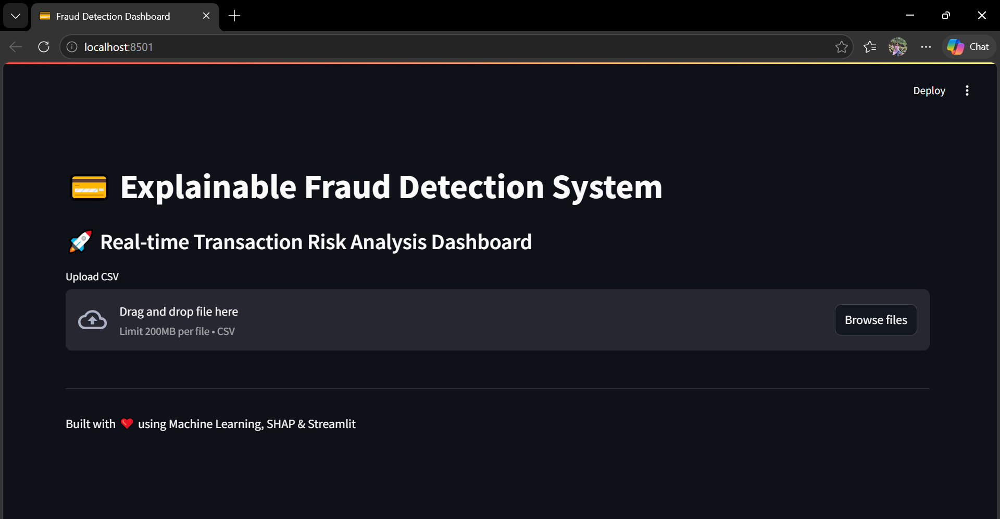
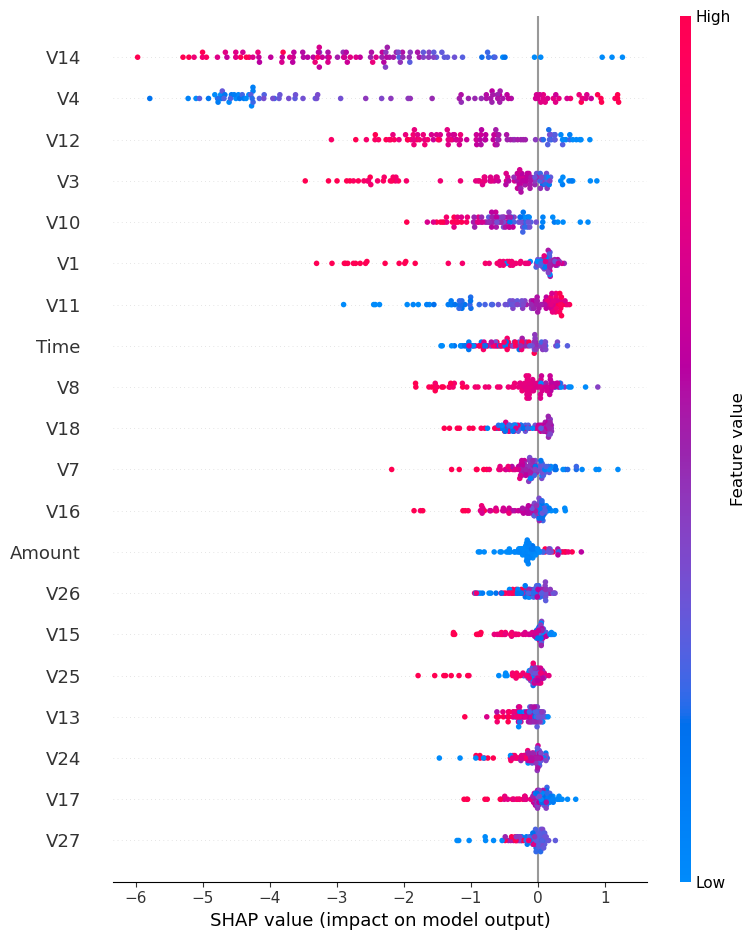

# 💳 Explainable Fraud Detection System

🚀 A machine learning-powered fraud detection system with explainable AI and an interactive dashboard.

---

## 📌 Overview

This project detects fraudulent financial transactions using **XGBoost** and provides **model explainability using SHAP**.  
It includes a **Streamlit dashboard** for real-time prediction, risk analysis, and visualization.

---

## 🧠 Features

- 🔍 Fraud detection using XGBoost
- ⚖️ Handles imbalanced data using SMOTE
- 📊 SHAP-based feature importance (Explainable AI)
- 📈 Interactive dashboard using Streamlit
- 🚨 Fraud detection metrics (Total, Fraud Count, Fraud Rate)
- 🔴 Highlights fraudulent transactions

---

## 🛠️ Tech Stack

- Python  
- Pandas, NumPy  
- Scikit-learn  
- XGBoost  
- SHAP  
- Streamlit  

---

## 📂 Project Structure
fraud-detection-project/
│
├── data/
│ └── creditcard.csv
│
├── notebook/
│ └── fraud_model.ipynb
│
├── model/
│ ├── model.pkl
│ └── shap_summary.png
│
├── app/
│ └── app.py
│
├── requirements.txt
└── README.md
---

## 🚀 How to Run

### 1️⃣ Clone the repository
git clone https://github.com/your-username/fraud-detection-project.git
cd fraud-detection-project

### 2️⃣ Install dependencies

pip install -r requirements.txt

### 3️⃣ Run the Streamlit app

cd app
streamlit run app.py

---

## 📊 Usage

1. Upload a CSV file (same format as dataset)
2. View:
   - Fraud predictions
   - Fraud probability (risk score)
   - Key metrics
   - Highlighted suspicious transactions
   - SHAP-based feature importance

---

## 🧠 Model Details

- Algorithm: **XGBoost Classifier**
- Imbalance Handling: **SMOTE**
- Evaluation Metric: **ROC-AUC**
- Explainability: **SHAP (Shapley Values)**

---

## 📸 Screenshots

_Add screenshots of your dashboard here_
### 🔹 Dashboard

### 🔹 SHAP Feature Importance

---

## 💡 Future Improvements

- Real-time API integration  
- Live transaction monitoring  
- Advanced anomaly detection  

---

## 👩‍💻 Author

**Noureen Fatima**  
- GitHub: https://github.com/Noureen717  
- LinkedIn: https://www.linkedin.com/in/noureen--fatima/

---

## ⭐ If you like this project, give it a star!